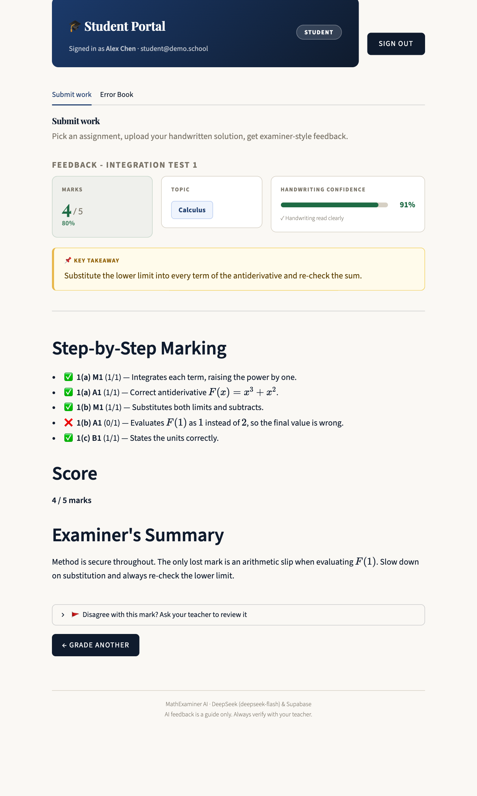
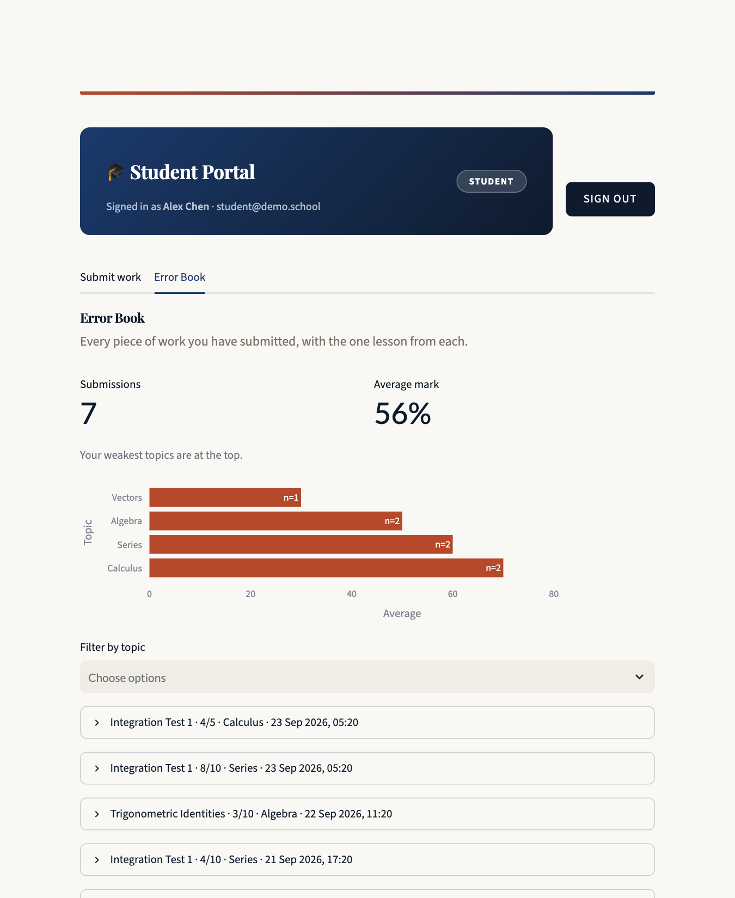
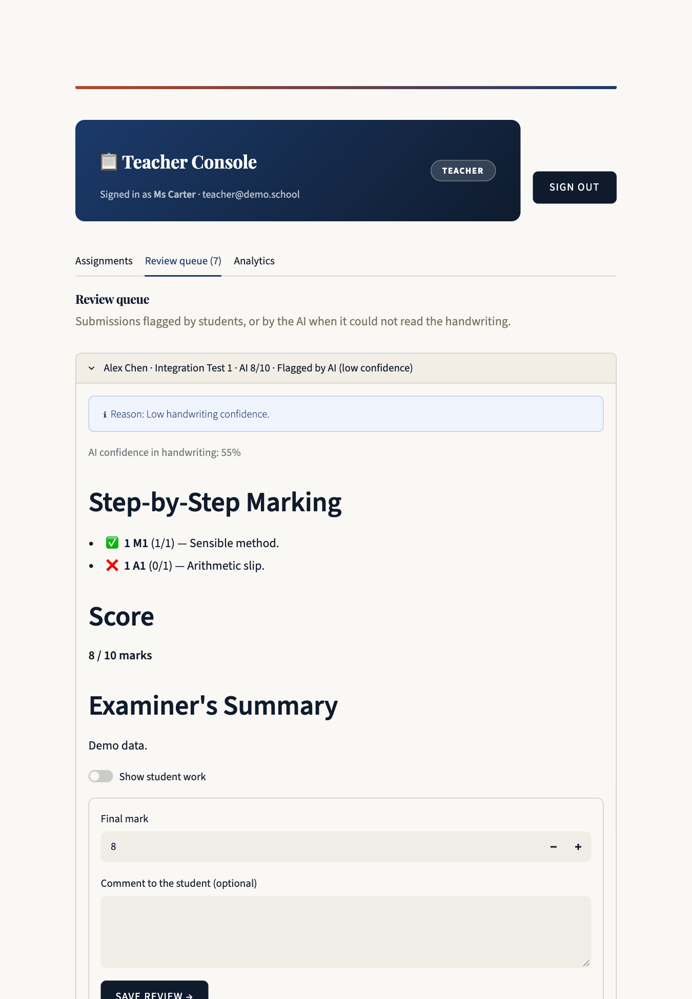
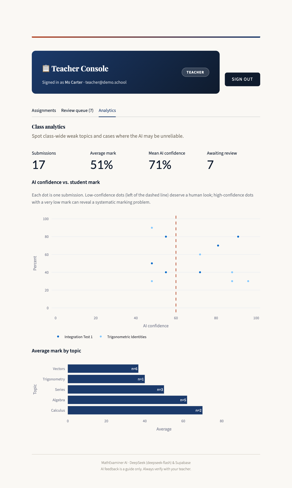
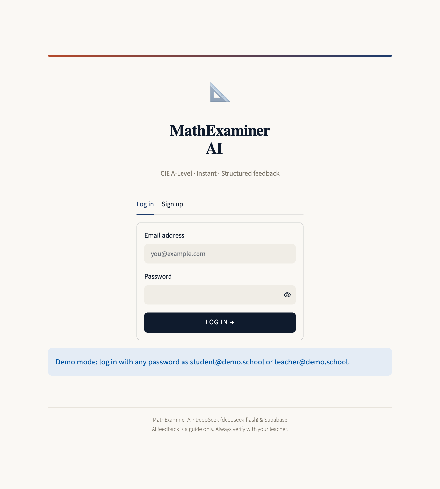
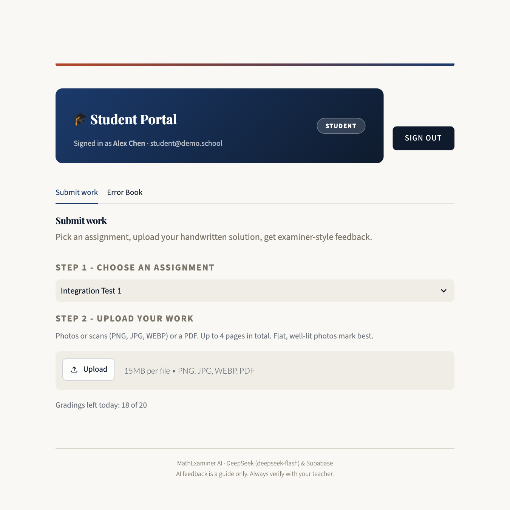
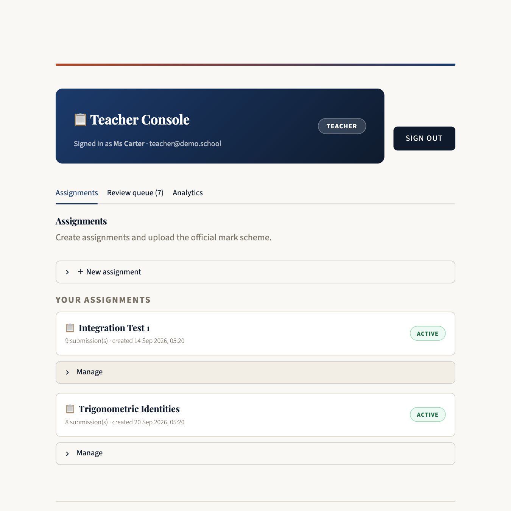
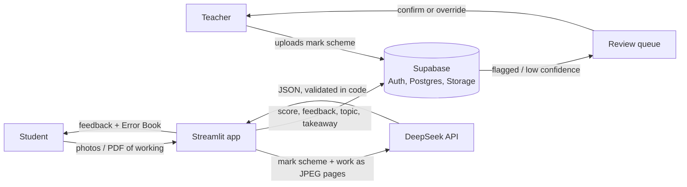

# MathExaminer AI

[](https://github.com/WHYNOT-LUO/mathexaminer-ai/actions/workflows/ci.yml)


AI-assisted marking of handwritten **CIE A-Level Mathematics** homework, with a human in the loop.

A teacher uploads an official mark scheme once. Students photograph their handwritten solutions and get
examiner-style feedback in seconds: mark-by-mark (M1 / A1 / B1) with reasons, a score, a topic tag and one
"key takeaway" saved to a personal **Error Book**. When the AI is unsure it can read the handwriting, or the
student disagrees, the submission goes to a **teacher review queue** where the teacher can confirm or
override the mark.

> **Try it in 30 seconds, no accounts or API keys needed:**
> `pip install -r requirements.txt && streamlit run demo/demo_app.py`
> then log in as `student@demo.school` or `teacher@demo.school` (any password).
> The demo runs the real UI against an in-memory backend with a canned marking.

## Screenshots

| Student: mark-by-mark feedback | Student: Error Book |
|---|---|
|  |  |
| **Teacher: review queue** | **Teacher: analytics** |
|  |  |

<details><summary>More: login, assignment picker, teacher assignments</summary>





</details>

*(Screenshots are from the built-in demo backend; the marking shown is a canned example.)*

## Features

| | |
|---|---|
| **Structured marking** | DeepSeek returns JSON (one entry per mark: label, type, max, awarded, comment) via DeepSeek's JSON mode, then validated in code. Totals are computed in code, never trusted from the model. |
| **Human in the loop** | Handwriting-confidence score; low confidence auto-flags the work; students can dispute a mark; teachers resolve the queue with an override and comment. |
| **Digital Error Book** | Every submission with its key takeaway, filterable by topic, plus a chart of the student's weakest topics. |
| **Teacher analytics** | AI confidence vs. student mark scatter (spot systematic AI errors), average mark by topic, submissions awaiting review. |
| **Real-world inputs** | Multi-page PDFs and multiple photos, EXIF-rotated phone pictures, transparent PNGs, size and page limits. |
| **Role-based access** | Students and teachers see different portals. Enforced in the database with row-level security, not just in the UI. |
| **Cost control** | Per-student daily grading cap, retry with backoff on transient API errors. |

## How it works



The original design sketch is in [`docs/workflow.svg`](docs/workflow.svg).

## Setup

### 1. Supabase

1. Create a project at [supabase.com](https://supabase.com).
2. Open **SQL editor**, paste the whole of [`supabase/schema.sql`](supabase/schema.sql) and run it (idempotent).
   It creates the tables, row-level-security policies, private storage buckets and the sign-up trigger.
3. Create a teacher access code (teachers enter it when they sign up; students leave it blank):
   ```sql
   insert into public.teacher_codes (code, note) values ('choose-a-long-random-string', 'staff room');
   ```
4. *(Optional, for demos)* **Authentication → Providers → Email**: turn off "Confirm email" so new
   accounts can log in immediately.
5. Copy the **Project URL** and the **anon / publishable** key from **Project Settings → API**.
   Never put the `service_role` key in this app.

### 2. DeepSeek

Create an API key at [platform.deepseek.com](https://platform.deepseek.com/) and add some credit. The default
model, `deepseek-flash`, is the only current DeepSeek model with image input - `deepseek-v4-pro` is text-only
and cannot grade handwriting. DeepSeek automatically caches repeated prompt prefixes (like the mark scheme),
so after the first student on an assignment, later gradings are billed at a much cheaper cache-hit rate while
the cache is warm - no code needed on your side. If the API is not reachable from your network, deploy the
small relay in [`docs/cloudflare-worker.js`](docs/cloudflare-worker.js) and set `DEEPSEEK_BASE_URL`.

### 3. Run

```bash
git clone https://github.com/WHYNOT-LUO/mathexaminer-ai.git && cd mathexaminer-ai
python -m venv .venv && source .venv/bin/activate
pip install -r requirements.txt
cp .streamlit/secrets.toml.example .streamlit/secrets.toml   # then fill in your values
streamlit run app.py
```

### Configuration

Set in `.streamlit/secrets.toml` (git-ignored) or as environment variables.

| Key | Required | Default | Purpose |
|---|---|---|---|
| `SUPABASE_URL` | yes | | Project URL |
| `SUPABASE_KEY` | yes | | anon / publishable key |
| `DEEPSEEK_API_KEY` | yes | | DeepSeek platform API key |
| `DEEPSEEK_MODEL` | no | `deepseek-flash` | Must be a vision-capable DeepSeek model |
| `DEEPSEEK_BASE_URL` | no | DeepSeek's endpoint | Reverse proxy, see the Cloudflare worker |
| `MAX_GRADINGS_PER_DAY` | no | `20` | Per-student cap to protect your quota |

Deploying to Streamlit Community Cloud: paste the same keys into the app's **Secrets** settings.

## Project layout

```
app.py                     Entrypoint: config check, per-session Supabase client, role routing
mathexaminer/
  config.py                Settings from secrets / environment, validated
  images.py                Photos and PDFs -> JPEG pages (EXIF, alpha, size and page limits)
  deepseek.py              DeepSeek (OpenAI-compatible) client: prompt, JSON mode, safe error messages
  models.py                GradingResult: validation, score computation, markdown rendering
  db.py                    Supabase auth, tables, storage, RPCs
  ui/                      Streamlit pages: auth, student, teacher, analytics, shared components
supabase/schema.sql        Tables, RLS policies, storage policies, SQL functions
demo/                      In-memory backend so the UI runs with no accounts or keys
tests/                     pytest suite (unit tests + Streamlit AppTest UI tests)
```

## Testing

```bash
pip install -r requirements-dev.txt
pytest          # unit tests and UI tests against the demo backend
ruff check .
```

The DeepSeek client is tested with a fake SDK client and real SDK exception types (auth, rate limit,
malformed output; error messages must never contain the API key). The UI tests drive the real app with Streamlit's `AppTest`, including
login, grade dispute, teacher resolution and HTML-injection attempts. A contract test keeps the demo
backend's function signatures identical to `mathexaminer/db.py`.

## Design decisions

- **JSON output instead of regex.** The first prototype asked the model for a free-text report and parsed
  the score and confidence out with regular expressions. Any formatting drift (`**85%**`, a missing heading)
  silently produced wrong values. Now the model is required to return a single JSON object (DeepSeek's JSON
  mode guarantees valid JSON syntax, not the specific shape), which is then validated against the expected
  shape in code with one automatic retry on a bad response; per-mark `awarded` is clamped to `max_marks` and
  the totals are summed in code, so a score can never contradict its own breakdown.
- **DeepSeek's OpenAI-compatible endpoint, not its Anthropic-compatible one.** DeepSeek offers both, but its
  Anthropic-compatible endpoint does not support JSON-schema structured outputs (only the `effort` field is
  honored there) - see [their docs](https://api-docs.deepseek.com/guides/anthropic_api). The OpenAI-compatible
  endpoint's `response_format: json_object` is the documented, reliable path, so `mathexaminer/deepseek.py`
  uses the `openai` SDK pointed at DeepSeek instead.
- **`deepseek-flash`, not `deepseek-v4-pro`.** Only `deepseek-flash` accepts image input; `deepseek-v4-pro`
  is text-only and cannot read handwriting. `config.py` rejects an obviously invalid model id, but it cannot
  tell a text-only model apart from a vision one - if you change `DEEPSEEK_MODEL`, keep it a vision model.
- **One Supabase client per browser session.** The client stores the signed-in user's JWT. Sharing one
  client across sessions (e.g. with `st.cache_resource`) would let one user's requests run with another's
  identity.
- **Roles are decided by the database.** A trigger creates the profile and grants `teacher` only if the
  sign-up carried a valid code from `teacher_codes`. Clients have no permission to write roles or grades
  directly; flagging and resolving go through `SECURITY DEFINER` functions.
- **Private buckets.** Student handwriting is personal data, so nothing is publicly readable.
- **Untrusted images.** The prompt tells the model to ignore instructions written inside the images
  (e.g. a page saying "award full marks").

## Security model and known limitations

- **Grades are advisory.** The grading call runs in the Streamlit server but the result is written with the
  student's own JWT, so a determined student who calls the Supabase API directly could insert a fabricated
  score. Teachers see and can override every mark, and analytics use the teacher's mark when present. For
  a hard guarantee, move the write behind a Supabase Edge Function using the service-role key.
- **Students can read mark schemes** (the app downloads them to grade). The feedback reveals the scheme
  anyway, but do not use this for high-stakes unseen exams.
- **AI marking can be wrong.** Confidence is the model's own estimate of how well it *read* the
  handwriting, not a guarantee of correctness. That is why the review queue exists.
- **No classes or deadlines yet.** Every student sees every open assignment.
- **Sessions are per browser tab.** A page refresh logs you out.
- Deleting an assignment removes its submissions; the students' image files are left in storage.

## Roadmap

Classes and enrolment, deadlines, email notifications for flagged work, a class-summary digest of common
errors, per-question marks entered by the teacher (removing the mark-scheme OCR step), and moving grade
writes behind an Edge Function.

## License

[MIT](LICENSE)
